# GradientFlow


> **🏆 Build Your Own AI Lab | Gradient Hackathon Submission**
>
> **Track 2: Building Applications**

[English](./README_HACKATHON_EN.md) | [中文](./README.md)

[](https://github.com/yourusername/gradientflow)
[](https://github.com/GradientHQ/parallax)
[](./LICENSE)

---

## 📸 Product Demo


<video src="./assets/GradientFlow_Demo2.mp4" controls width="800"></video>

_If the video does not play, [click here to download](./assets/GradientFlow_Demo2.mp4)_

**More Screenshots**: [RAG Knowledge Base](#rag-knowledge-base--ai-summary) | [Document Analysis](#intelligent-document-analysis) | [Agent Configuration](#agent-configuration--mcp-tools)

---

## 🔗 Links

- **Live Demo**: [gradientflow-chat-production.up.railway.app](https://gradientflow-chat-production.up.railway.app/)
- **Xiaohongshu**: [GradientFlow](http://xhslink.com/o/1CF3tnSUnuE)
- **Parallax**: [github.com/GradientHQ/parallax](https://github.com/GradientHQ/parallax)

---

## 🎯 What is GradientFlow?

**GradientFlow** is a privacy-first, AI-native local workspace platform built to give teams and individuals secure, intelligent collaboration. Powered by [**Parallax**](https://github.com/GradientHQ/parallax), it uses distributed local compute to run powerful AI agents without data ever leaving your infrastructure.

### 💡 The Problem We Solve

| Challenge                 | Cloud AI Solutions                           | GradientFlow + Parallax                                               |
| ------------------------- | -------------------------------------------- | --------------------------------------------------------------------- |
| **Data Privacy**          | Sensitive data sent to third-party servers   | All data stays on your own hardware                                   |
| **Cost**                  | Pay-per-token pricing adds up fast           | Zero inference costs after setup                                      |
| **Latency**               | Network round-trips add delay                | Local inference = instant responses                                   |
| **Control**               | Vendor lock-in, model deprecation            | You own the models and infrastructure                                 |
| **Context Understanding** | Isolated conversations with little coherence | Fine-tuned context handling for history, @mentions, and reply threads |
| **Interaction Mode**      | Traditional bots respond passively           | Agents proactively join, filter context, and add insights             |

---

## 🔌 Deep Parallax Integration

[**Parallax**](https://github.com/GradientHQ/parallax) is the AI core engine of GradientFlow. We do more than call APIs—we embed Parallax across the stack.

### How We Integrate

| Component               | Parallax Role                                       | Technical Details                                 |
| ----------------------- | --------------------------------------------------- | ------------------------------------------------- |
| **Multi-Agent Manager** | Runs multiple agents concurrently on Parallax nodes | Python service deployed on Parallax compute nodes |
| **RAG Knowledge Base**  | Local vector retrieval so data never leaves         | ChromaDB + Parallax local inference               |
| **LLM Inference**       | Zero token cost local models                        | Supports Llama 3 / Mistral / Qwen, etc.           |
| **Tool Execution**      | Web search and MCP toolchain                        | Distributed task scheduling                       |

### System Architecture

```mermaid
graph TD
     User["User / Browser"] <--> Frontend["React Frontend"]
     Frontend <--> Backend["Express Server"]
     Backend <--> DB[("Local JSON DB")]

     subgraph "🔌 Parallax Compute Node"
          AgentMgr["Multi-Agent Manager"]
          RAG["RAG Service / ChromaDB"]
          MCP["MCP Tool Service"]
          LLM["Local LLM"]

          AgentMgr <--> LLM
          AgentMgr <--> RAG
          AgentMgr <--> MCP
     end

     Backend <--> AgentMgr
```



### Benefits from Parallax

- **Privacy First**: All chat logs, documents, and embeddings remain on your hardware
- **Cost Efficiency**: Orchestrate consumer GPU clusters and eliminate token fees
- **Low Latency**: Local inference yields millisecond responses
- **Scalability**: Add more nodes to the Parallax cluster anytime

### 🖥️ Hardware Used for the Demo

| Component     | Specification            |
| ------------- | ------------------------ |
| **GPU**       | 2 × NVIDIA RTX 5080      |
| **Model**     | GPT-OSS 20B              |
| **Inference** | Parallax Local Inference |


> 💡 Two RTX 5080 GPUs are enough to smoothly run a 20B-parameter LLM, showing how capable consumer hardware can be.

---

## ✨ Core Features

### 🤖 Intelligent Local Agents `🔌 Parallax Powered`

- **Multi-Agent System**: Run multiple agents simultaneously (`@Coder`, `@Writer`, `@Researcher`), all powered by Parallax local LLMs
- **Agent Selector**: Dropdown with keyboard navigation for online agents
- **RAG Retrieval-Augmented Generation** `🔌`: Upload documents to a local knowledge base; agents retrieve private data via ChromaDB
- **Web Search** `🔌`: Integrated DuckDuckGo search executed through Parallax nodes
- **MCP Integration** `🔌`: Model Context Protocol support via FastMCP for extended tool capabilities
- **Sequential Tool Calling**: Multi-round tool execution
- **Max Round Control**: Configurable maximum rounds for agent replies

### 💬 Modern Chat Experience

- **Smart Context Management**: Fine-tuned handling of history, replies, and @mentions
- **Rich Text Support**: Markdown and code highlighting
- **Interactive UX**: Emoji reactions, quote replies, @mentions
- **Smart Summaries** `🔌`: One-click AI summaries of long threads
- **Real-time Sync**: Typing indicators and live message updates
- **LLM Settings**: Configurable endpoint, model, and API key

### 🛡️ Secure & Self-Hosted

- **Full Control**: You own the code, data, and models
- **Authentication**: Secure JWT-based login system
- **Persistent Storage**: All chat history stored locally

---

## ⚡ Quick Start

### Prerequisites

- Node.js 18+
- Python 3.8+
- A running Parallax node (or local GPU environment)

### Step 1: Configure Parallax

GradientFlow relies on Parallax for local LLM inference. Complete Parallax installation first: **[Parallax Repository](https://github.com/GradientHQ/parallax)**

Follow the Installation and Quick Start instructions there, then confirm your Parallax node is running.

### Step 2: Start GradientFlow Services (5 terminals)

1. **Clone and install**
   ```bash
   git clone https://github.com/zengyuzhi/gradientflow.git
   cd gradientflow
   npm install
   ```
2. **Backend API**
   ```bash
   npm run server
   ```
3. **RAG service**
   ```bash
   cd agents/rag
   pip install -r requirements.txt
   python rag_service.py --port 4001
   ```
4. **MCP research service (optional)**
   ```bash
   cd agents/mcp
   pip install -r requirements.txt
   python mcp_research_server.py --transport sse --port 3001
   ```
5. **Agent service**
   ```bash
   cd agents
   pip install -r requirements.txt
   python agent_runner.py
   ```
6. **Frontend dev server**
   ```bash
   npm run dev
   ```
7. **Visit the app**
   Go to `http://localhost:5173` and log in with:
   - Email: `root@example.com`
   - Password: `1234567890`

> **Startup Order**: Backend → RAG Service → MCP Service (optional) → Agent Service → Frontend

---

## 📷 More Screenshots

### RAG Knowledge Base + AI Summary


### Intelligent Document Analysis


### Agent Configuration + MCP Tools


---

## 📄 License

MIT License - see [LICENSE](./LICENSE) for details.

---

Built with love for the Gradient Network community.

**#BuildYourOwnAILab #Parallax #GradientNetwork**
